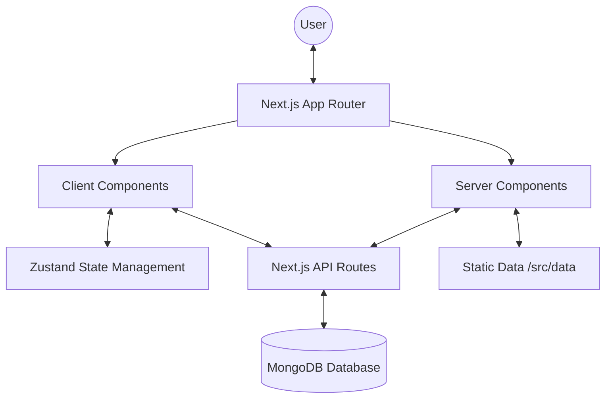

# Architecture Documentation - Indian Tourism App

This document provides a high-level overview of the Indian Tourism App's architecture, technology stack, and directory structure.

## High-Level Architecture

The Indian Tourism App is a modern web application built with **Next.js 15**, leveraging the **App Router** for routing and server-side rendering. It follows a hybrid approach using both static data and a dynamic **MongoDB** database for destination management.

## Technology Stack

| Category | Technology |
| :--- | :--- |
| **Framework** | [Next.js 15](https://nextjs.org/) (React 19) |
| **Styling** | [Tailwind CSS 4](https://tailwindcss.com/), [Framer Motion](https://www.framer.com/motion/) |
| **State Management** | [Zustand](https://zustand-demo.pmnd.rs/) |
| **Database** | [MongoDB](https://www.mongodb.com/) with [Mongoose](https://mongoosejs.com/) |
| **Authentication** | JWT, bcryptjs, Google OAuth |
| **Visuals** | [Three.js](https://threejs.org/), [React Three Fiber](https://docs.pmnd.rs/react-three-fiber), [Spline](https://spline.design/) |
| **Icons** | [Lucide React](https://lucide.dev/), [React Icons](https://react-icons.github.io/react-icons/) |

## Directory Structure

- **`src/app/`**: Contains the application routes, layouts, and API endpoints. Follows the Next.js App Router convention.
- **`src/components/`**: Reusable UI components (buttons, cards, navbars, etc.).
- **`src/data/`**: Static datasets for destinations, tourism info, and state connections.
- **`src/lib/`**: Core utilities and initializations (database connection, authentication logic, custom middleware).
- **`src/models/`**: Mongoose schemas for MongoDB (User, Destination).
- **`src/store/`**: Zustand storage definitions for global state management (Auth, App, Mood).
- **`src/utils/`**: Generic helper functions used across the project.
- **`public/`**: Static assets like images and font files.

## Data Flow

1.  **Static Content**: Initial page loads often pull data from `src/data` for fast rendering.
2.  **Dynamic Content**: User-specific data and destination details are fetched via **Next.js API Routes** from **MongoDB**.
3.  **Global State**: **Zustand** manages the UI state (e.g., current mood, user session, loading states) across client components.
4.  **Authentication**: Handled via custom JWT implementation and Google OAuth, with middleware protecting sensitive routes.

## Design System

The application uses a premium design system built with:
- **Tailwind CSS 4** for responsive and consistent styling.
- **Radix UI** primitives for accessible components (labels, checkboxes).
- **Glassmorphism** and high-quality 3D visuals using **Three.js** and **Spline**.
