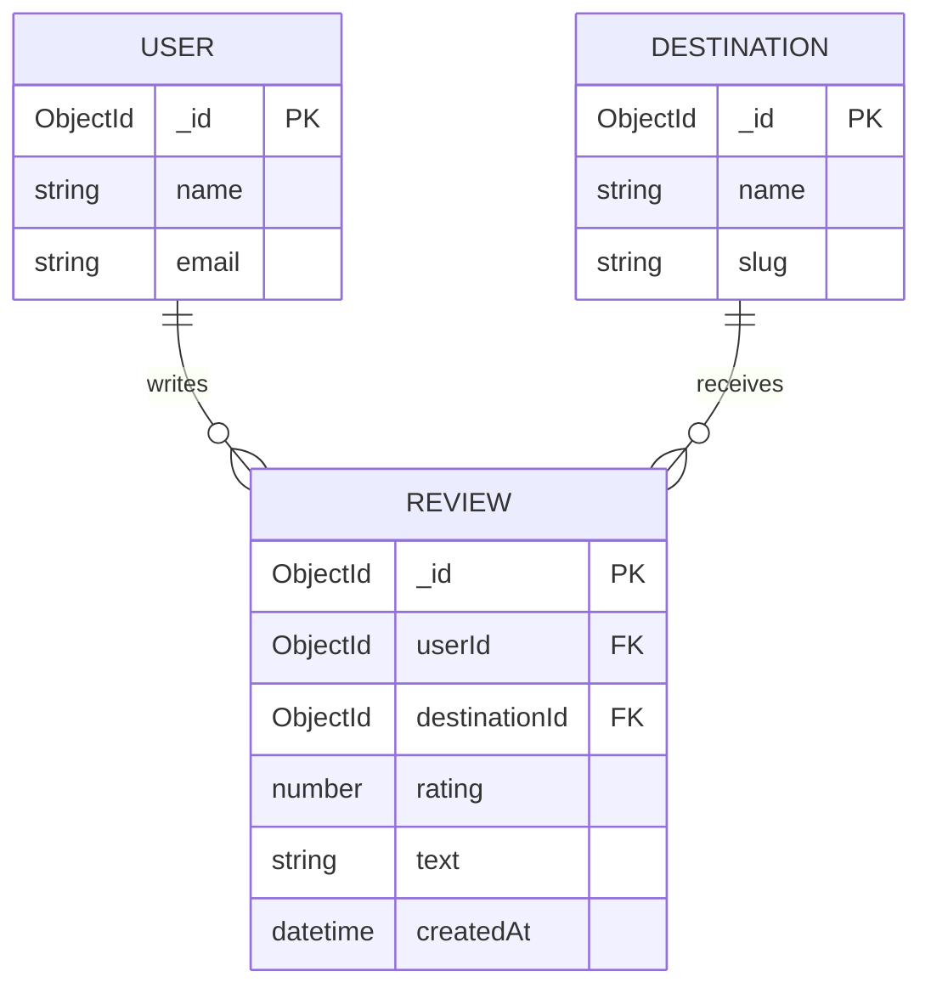

# Database Schema — Indian Tourism App

This document summarizes the MongoDB (Mongoose) schema used in the project, suitable for inclusion in an academic report.

## Overview
- Database: MongoDB (Mongoose)
- Models covered: `User`, `Destination`

---

## Models

### User
- Collection name: `users` (model `User`)
- Primary key: `_id` (ObjectId)

Fields:
- `name`: String, required
- `email`: String, required, unique, lowercase
- `password`: String, required
- `googleId`: String, unique, sparse (optional)
- `image`: String, default null
- `lastLogin`: Date, default null
- `preferredMood`: String, enum [Happy, Sad, Lonely, Romantic, Adventurous, Stressed, Calm, Excited, Spiritual], default null
- `preferredSeason`: String, enum [Summer, Monsoon, Winter, Spring], default null
- `preferredBudget`: String, enum [Low, Medium, Luxury], default `Medium`
- `preferredTravelType`: String, enum [Solo, Couple, Friends, Family], default null
- `preferredLandscape`: String, enum [Beach, Mountains, Desert, Forest, Hill Station, City, Backwaters], default null
- `favoriteDestinations`: Array of Mixed, default [] (stores destination objects or IDs)
- `moodHistory`: Array of subdocuments { mood: String, season: String, timestamp: Date }
- `travelJournal`: Array of subdocuments { destination: String, entry: String, visitDate: Date, images: [String], rating: Number, createdAt: Date }
- `plannedTrips`: Array of subdocuments { title: String, startDate: Date, endDate: Date, destinations: [String], notes: String }
- `darkMode`: Boolean, default false
- Timestamps: `createdAt`, `updatedAt` (enabled by schema option)

Notes:
- `favoriteDestinations` is flexible (Mixed) — check app logic to determine whether it stores destination IDs or embedded objects.

---

### Destination
- Collection name: `destinations` (model `Destination`)
- Primary key: `_id` (ObjectId)

Fields:
- `name`: String, required, unique
- `slug`: String, required, unique
- `state`: String
- `region`: String
- `latitude`: Number
- `longitude`: Number
- `description`: String
- `longDescription`: String
- `heroImage`: String
- `gallery`: [String]
- `bestTimeToVisit`: [String]
- `season`: [String], enum [Summer, Monsoon, Winter, Spring]
- `moodMatch`: [String], enum [Happy, Sad, Lonely, Romantic, Adventurous, Stressed, Calm, Excited, Spiritual]
- `landscape`: [String], enum [Beach, Mountains, Desert, Forest, Hill Station, City, Backwaters]
- `budget`: subdocument { low: { daily: Number, description: String }, medium: { daily: Number, description: String }, luxury: { daily: Number, description: String } }
- `itinerary`: subdocument { day1: String, day2: String, day3: String }
- `nearbyAttractions`: [{ name: String, distance: String, description: String }]
- `localFood`: [{ name: String, description: String, whereToTry: String }]
- `culturalHighlights`: [String]
- `weatherInfo`: { summer: String, monsoon: String, winter: String, spring: String }
- `safetyRating`: Number (1-5)
- `sustainabilityScore`: Number (1-5)
- `crowdLevel`: String enum [Low, Medium, High]
- `localLanguages`: [String]
- `travelTips`: [String]
- `mapsUrl`: String
- `rating`: Number (1-5), default 0
- `reviews`: [{ userId: ObjectId, userName: String, rating: Number, text: String, createdAt: Date }]
- Timestamps: `createdAt`, `updatedAt` (enabled by schema option)

Notes:
- `reviews.userId` references a `User` `_id` (ObjectId) — this creates a relationship between users and destination reviews.

---

## ER Diagram (Mermaid)

Notes on the diagram:
- The codebase stores reviews as subdocuments inside `Destination.reviews` (embedded), with `userId` pointing to the `User` document.
- Favorite destinations in `User.favoriteDestinations` are stored as Mixed and may be either embedded objects or references.

---

## How to cite these schemas in your report
- Reference the files: `src/models/User.ts` and `src/models/Destination.ts`.
- Mention that the database is MongoDB Atlas and the connection logic is in `src/lib/mongodb.ts` (reads `MONGODB_URI` from environment).

---

If you want, I can also produce:
- A relational-style (tables + columns) representation for ER-to-relational comparison.
- A PDF export of this document suitable for submission.

